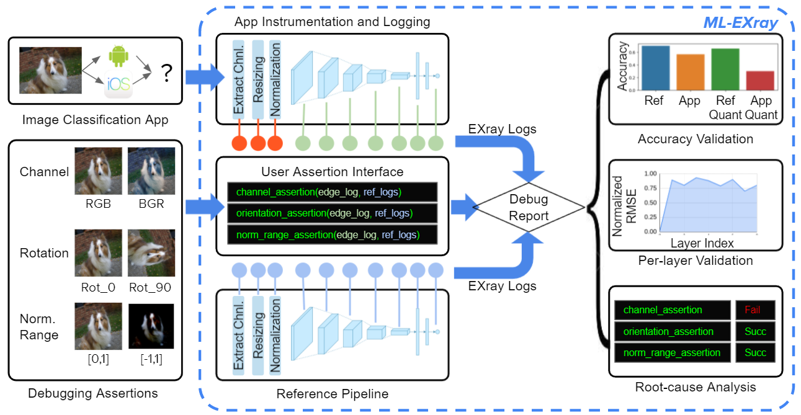

# ML-EXray: Visibility to ML Deployment on the Edge

ML-EXray is an open-source research library for ML execution monitoring and debugging on edge devices.
 It provides visibility into *layer-level details* of the ML
execution, and helps developers analyze and debug cloud-to-edge deployment issues. It includes a suite of
instrumentation APIs for ML execution logging and an end-to-end deployment validation library. Users and app developers
can catch complicated deployment issues just by writing a few lines of instrumentation and assertion code.

For more details, please see our MLSys paper: https://arxiv.org/abs/2111.04779



#### Workflow Overview  
* Instrument your mobile apps using ML-EXray APIs to produce *EXray logs* 
(*<span style="color:green">green</span>*) from your edge devices.  

* Plays back the same data using a reference pipeline (often extracted 
from the training pipeline) to produce the reference *EXray logs* 
(*<span style="color:blue">blue</span>*).

* ML-EXray compares edge logs with reference logs and reports potential issues 
like accuracy degradation, per-layer output drift, and user-defined assertion results.

#### Customization
* *Assertion functions:* users can define custom debugging assertions to validate 
suspected issues, such as input channel arrangement, orientation, and normalization range.

* *Log Elements:* users can instrument the app at any point throughout the pipeline 
to log custom variables for different debugging purposes. (*e.g.* intermediate 
preproccesing values as shown in *<span style="color:red">red dots</span>*)

* *Reference Pipelines:* users can provide alternative pipelines as references, 
such as a previous successful deployment pipeline on a different device.


## Getting Started

ML-EXray provides a suite of instrumentation and analysis APIs in C++, JAVA, and Python corresponding to tensorflow lite APIs. 
This documentation focuses on giving examples of using the tool 
to debug edge ML deployment issues. 
For complete API documentations, please refer to each individual page 
([C++ API](), 
[JAVA API](docs/MLEXray_java.md), 
[Python API](edgeml/python/README.md)). 

We use an image classifier app as an example to illustrate the process of ML-EXray catching
potential issues and bugs in an edge ML pipeline. To this end, we provide the following:
* An android image classifier app using various TFLite ML models
* A correct reference pipeline of these models in python
* Models and their quantized version, as well as conversion scripts
* Scripts to analyze and reproduce results in the ML-EXray paper


### Tutorial Index
* [Try the app and get the logs](#an-android-image-classifier-app)
* [Debug model quantization issues](#debug-quantization-issues) ([colab](https://colab.research.google.com/drive/16353Cw-1O7Hn1iOyIA8NNjhzRNJtI-VT?usp=sharing))
* [Visualize preprocessing bug impact](#pre-processing-bugs-and-impact-on-accuracy)
* [Evaluate per-layer latency on heterogeneous hardward](#evaluate-per-layer-latency)

### Preparation: EXray logs
ML-EXray instrumentation APIs generate EXray logs to help user debug potential deployment issues.
For example, in each run, the android app generate a trace of logs for each inference (Same for JAVA and Python APIs). 
Currently, user can use ML-EXray to log the following information
* *Input/Output*: Model input/output, Per-layer input/output, custom intermediate values (e.g. pre-processing input/output)
* Performance metrics: end-to-end latency, per-layer latency, memory
* Periferal sensors (Android only): Orientation, Inertial Motion, Lighting, etc.

ML-EXray also includes scripts to parse the logs and perform meaningful analysis.

#### Trace download [all](https://drive.google.com/drive/folders/1Of-9DBarpc6SricdQqzdcJP-jAhKYEXI?usp=sharing):

We provide example traces from our experiments under the data folder for demo purpose. 

|Dataset|Trace|
|---|---|
|Imagenet2012_1|[download (2.72G)](https://drive.google.com/file/d/1vFxLJfEUC4vV5TiUgXWLf0x1BhYgfuHZ/view?usp=sharing)|
|Imagenet2012_100|[download (2.82G)](https://drive.google.com/file/d/19tVQiZeS_M2JOACbOFf2sYby_Y4D3xtY/view?usp=sharing)|

The folder architecture is as follows
```
trace_[DatasetName]
  - [ModelName]
    - [Config]_[PreprocessOption]
```

For example
```
trace_imagenet2012_100
  - MobileNetV1
    - Cloud
    - CloudQuant
    - Edge_BGR
    - Edge_Bilinear
    - EdgeQuant_[0,1]
  - MobileNetV2
    - Cloud
    - CloudQuant
    - Edge
    - EdgeRefOp    
    - EdgeQuant_Bilinear
```


## An Android image classifier app
### Using the binary
Install the binaries on your edge devices. 
We provide binaries for 4 architectures, arm, arm64, x86, and x86_64.

#### Binary download [all](https://drive.google.com/drive/folders/1jak0X4c-y7WA4cnp7JIOiWwEIGL5VtOw?usp=sharing): 
|Kernels|arm64|arm|x86_64|x86|
|---|---|---|---|---|
|Optimized OpResolver|  [arm64](https://drive.google.com/file/d/1A8wTu-6fxXystyrtxo7WH3Kt7BLrSTm_/view?usp=sharing) | [arm](https://drive.google.com/file/d/1xaGfL8YTsHP3FVRjIDbl37zTWsFJzxPY/view?usp=sharing) |  [x86_64](https://drive.google.com/file/d/1KNrnqU1Y7KspxEDOxYZ8Oc5-HFwO_aYj/view?usp=sharing) | [x86](https://drive.google.com/file/d/1FlJBV3d8LzONHTzponO0wHIGbTyWmA5v/view?usp=sharing) |
|Reference OpResolver| [arm64](https://drive.google.com/file/d/1E7NSUWJgn9hjmDRpAcnO1KKZSijylCFp/view?usp=sharing) | [arm](https://drive.google.com/file/d/1aJ_FOjUe0XSjJFvm2j-E4loK2x148p0E/view?usp=sharing) |  [x86_64](https://drive.google.com/file/d/1MUI7NBujhZazAny9gc-3BWqHBUoLMpwR/view?usp=sharing) | [x86](https://drive.google.com/file/d/1LisHHu0H1nGTNlauwLGWsFiOo6C70fUa/view?usp=sharing) |

The binary comes with 8 models in both floating-point version and quantized version.
To test your own models, please build from source and put your model in the [examples/android/TFliteCppApp/assets](examples/android/TFliteCppApp/assets) folder.

Models included in the app can be downloaded [here](https://drive.google.com/drive/folders/1iaq2NrWiub0pLLDaIeyc6lNxzLu0RDYU?usp=sharing) 


| Model | Float | Int8 (Quantized) |
|---|:---:|:---:|
| MobileNet v1 | [MobileNetV1_imagenet_224](https://drive.google.com/file/d/1SbDCACz2Z3CVqJi7sQ-5DV0txUey-xqq/view?usp=sharing) | [MobileNetV1_imagenet_quant_224](https://drive.google.com/file/d/1NnkZmUCPZ0gsM3te7rUcfIU-xta_gxeb/view?usp=sharing)
| MobileNet v2 | [MobileNetV2_imagenet_224](https://drive.google.com/file/d/1yO1nvHnbXAz_o8-CTbxseg8gtUp60Xk0/view?usp=sharing) | [MobileNetV2_imagenet_quant_224](https://drive.google.com/file/d/1JHw_5CNtfw7QiEPU3uTQ_BDDQVDTuEzS/view?usp=sharing)
|MobileNet v3 Large|[MobileNetV3_Large_imagenet_224](https://drive.google.com/file/d/180ogmBegGBVrypbCFqpNofI2kHAU4rju/view?usp=sharing)|[MobileNetV3_Large_imagenet_quant_224](https://drive.google.com/file/d/1TM7XopfqU8FDZNE5_ckeSOoynzEy7jeC/view?usp=sharing)|
|MobileNet v3 Small|[MobileNetV3_Small_imagenet_224](https://drive.google.com/file/d/10QhYUjwNMJRDz8dKLwQgtXjrpa47zwxI/view?usp=sharing)|[MobileNetV3_Small_imagenet_quant_224](https://drive.google.com/file/d/19SqEtGsmd7KhnPENyJelcDW8Aohw712E/view?usp=sharing)|
|Inception v3|[InceptionV3_imagenet_299](https://drive.google.com/file/d/1RkV4S3g-iXHH6mAOPcwB5ulf9-IEei5H/view?usp=sharing)|[InceptionV3_imagenet_quant_299](https://drive.google.com/file/d/1yk7I9ocaIJ_o1z_b9-vqwRGnBNP1sNmh/view?usp=sharing)|
|Densenet 121|[DenseNet121_imagenet_224](https://drive.google.com/file/d/1t5viIm6WSYJrGKD5s7kib-foHWUdWBi2/view?usp=sharing)|[DenseNet121_imagenet_quant_224](https://drive.google.com/file/d/1x78CWJqg-xfSX6yYBhp1ffQWg7xuF63l/view?usp=sharing)|
|Resnet50 v2|[ResNet50V2_imagenet_224](https://drive.google.com/file/d/1AhxM57zmPcpVuxzMmgIXVzW7mH1cS_3G/view?usp=sharing)|[ResNet50V2_imagenet_quant_224](https://drive.google.com/file/d/13dlPWjD39ALrWNxreSbkvLrnwB3JfzmY/view?usp=sharing)|


Downloaded models must be put in models/ConvertedModels/[Modelname]/...tflite. For example,
```
models
|--ConvertedModels
|  |--MobilenetV1
|  |  |--MobilenetV1_imagenet_224.tflite
|  |  |--MobilenetV1_imagenet_quant_224.tflite
|  |--MobilenetV2
```

Configure the app for running options
* Hardward: CPU, GPU, NNAPI
* Logging level: None, IO, Embedding, Per-layer
* Resizing options: interpolation, area-averaging
* Channel arrangement: RGB, BGR
* Normalization range: [0.0,1.0], [-1.0,1.0]
* Rotation and number of threads


Cloud connection currently disabled for public tests.


### Building from source
ML-EXray is built from bazel, complied in android studio with bazel plugin. 
While compiling, make sure to specify bazel flags matching the device architecture, e.g. --config=android_x86_64 or --config=android_arm64 or --config=android_x86 or --config=android_arm

#### Prerequisites and tested version
* Android Studio Arctic Fox 2020.3.1
* Android Studio Bazel plugin
* Android SDK 11.0
* Android SDK Build-tools 30.0.3
* Android NDK 21.4.7075529
* Java runtime environment (OpenJDK JRE)
* JDK (default-jdk)
* Android Emulator 30.8.4 (need qemu_kvm)

#### Build the app
* Load the project in android studio *as a bazel project* using bazel import
* Download android SDK and NDK from the SDK manager of android studio 
* Specify SDK NDK path in WORKSPACE file
```python
android_ndk_repository(
    name = "androidndk",
    path = "<path-to-android-root>/Sdk/ndk/21.4.7075529",
)

android_sdk_repository(
    name = "androidsdk",
    path = "<path-to-android-root>/Sdk",
)
```
* Compile the bazel target: //examples/android/TFliteCppApp:edgemlinsight with arch flag e.g. --config=android_arm64, 
* or equivalently use bazel commands as follows
```bash
bazel build //examples/android/TFliteCppApp:edgemlinsight
--config=android_arm64
````

## Running the app on android emulator

* Download android image from emulator manager in android studio. 
* Create an emulated device using the image
* Install qemu_kvm for virtualization
* Make sure the user has ownership of /dev/kvm, o.w. emulator will be terminated
```
sudo chown $USER /dev/kvm
```
* Compile the app with --config matching the emulator architecture, e.g. --config=android_x86_64
* Run the app on the emulator device (AVD)


## Pre-processing bugs and impact on accuracy
To evaluate classification accuracy from EXray logs, please refer to the follwoing scripts
```python
python3 scripts/analysis/TopKAccuracy.py 
```
We provided examples trace (in ./data folder) of the same model running in different configurations (quantized vs. unquantized, BGR input vs RGB input, normalization range of [0,1] vs [-1,1]). 
The script evaluate and compare accuracies of these configurations. .

To evaluate your model with different configurations on your own dataset 
* Load your benchmark dataset (e.g. [data/0_data/imagenet2012_1](data/0_data/imagenet2012_1)) to your android device under /sdcard/edgeml/
* Choose your model to run the app.
* Use adb to pull the logs from the phone
* Evaluate the accuracy against your labels
       

## Debug quantization issues
 
### Using the app
* Load your image dataset (follow the format in the image data folder (e.g. [data/0_data/imagenet2012_1](data/0_data/imagenet2012_1))) into you android device under 
[/sdcard/edgeml/]() 

* On the app, choose the data source as local and the pasted image folder.
* Run any model in both quantized and floating point version.
* Run analysis script comparing the logs

The following scripts reproduce the result of Mobilenet v2 and v3. 
Each compares the quantized model's per-layer output against a correct cloud reference pipeline.
Note the quantized model can be run using optimized kernels and reference kernels. 
See more details [in the paper](https://arxiv.org/abs/2111.04779).


```python
# For Mobilenet v2
python3 scripts/analysis/mobilenetv2_quant_refop.py
# For Mobilenet v3
python3 scripts/analysis/mobilenetv3_quant_refop.py 
```

### Using Python API
For a full tutorial, please check the [colab](https://colab.research.google.com/drive/16353Cw-1O7Hn1iOyIA8NNjhzRNJtI-VT?usp=sharing)

To play back the same dataset using python API, please check the [python API documentation](edgeml/python/README.md)

You can use the same scripts above to visualize the per-layer differences between each run.


## Evaluate per-layer latency
We build on top of [TFLite benchmark tool](https://www.tensorflow.org/lite/performance/measurement) to evaluate per-layer latency, 
categorized by layer type. This information is logged in summary.log in each exray trace. 

## Evaluate system overhead

Please inspect EXray logs for end-to-end latency with and without logging enabled. 
To disable logging, specify the argument of EdgeMLMonitor_Native with no_logging_=True. 


## Citation

If ML-EXray helps your edge ML deployment, please cite:
```bibtex
@inproceedings{mlexray,
 author = {Qiu, Hang and Vavelidou, Ioanna and Li, Jian and Pergament, Evgenya and Warden, Pete and Chinchali, Sandeep and Asgar, Zain and Katti, Sachin},
 booktitle = {Proceedings of Machine Learning and Systems},
 editor = {D. Marculescu and Y. Chi and C. Wu},
 pages = {337--351},
 title = {ML-EXray: Visibility into ML Deployment on the Edge},
 url = {https://proceedings.mlsys.org/paper/2022/file/76dc611d6ebaafc66cc0879c71b5db5c-Paper.pdf},
 volume = {4},
 year = {2022}
}

```
