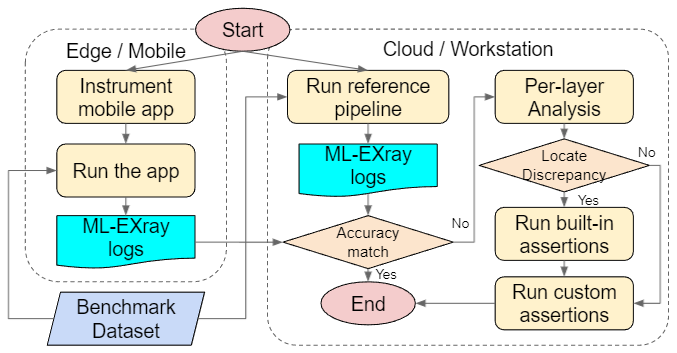

# ML-EXray: Visibility to ML Deployment on the Edge (Python Package)

ML-EXray is a validation framework for edge ML deployment. It provides visibility into layer-level details of the ML
execution, and helps developers analyze and debug cloud-to-edge deployment issues. It includes a suite of
instrumentation APIs for ML execution logging and an end-to-end deployment validation library. Users and app developers
can catch complicated deployment issues just by writing a few lines of instrumentation and assertion code.

*\*ML-EXray (Python Package) is currently distributed on TestPypi (https://test.pypi.org/project/MLEXray
) for internal testing.*

## Getting Started

Install the latest ML-EXray version from TestPypi

```
python3 -m pip install --upgrade -i https://test.pypi.org/simple/ MLEXray
```

The general workflow is shown below. First, use ML-EXray's API to log ML inference pipelines on the edge device or in
the cloud/workstations. Then, users can use the validation library to compare logs from two different pipelines to
verify per-layer-output. Finally, users can also define custom assertions to validate suspicious behaviors.



## Example Usage: Per-layer Validation

The following shows an example usage of comparing the per-layer output between a *quantized* versus an *unquantized*
model. To run the full example, please see the
example [colab](https://colab.research.google.com/drive/1K6MqVbXg8PPuEo9CUNbjHbGjA5knjiDr?usp=sharing).

### a) Logging ML inference

Initialize edge ML monitor with per layer logging capability.

```python
from MLEXray.EdgeMLMonitor.EdgeMLMonitor import EdgeMLMonitor

logDir = < LOG_OUTPUT_DIRECTORY >
mMonitor = EdgeMLMonitor()
mMonitor.set_logDir(logDir)
# enabling per-layer logging, this can cause the logging to take minutes to finish
mMonitor.set_per_layer_output_logging(True)
```

Initialize TF Lite interpreter with per layer logging. Optionally, use reference OpResolver.

```python
import tensorflow as tf

tflite_model_path = < TFLITE_MODEL_PATH >
OpResolver = tf.lite.experimental.OpResolverType.BUILTIN_REF
interpreter = tf.lite.Interpreter(model_path=tflite_model_path,
                                  experimental_preserve_all_tensors=True,
                                  experimental_op_resolver_type=OpResolver)
```

Log ML execution around TF Lite inference.

```python
mMonitor.onInferenceStart()
interpreter.invoke()
mMonitor.onInferenceStop(interpreter)
```

This will produce the log file in a user specificed directory: <LOG_OUTPUT_DIRECTORY>

**Note**: There are similar *C++ APIs* to log TF Lite inference in environments other than python, e.g. on edge devices
like such as Edge TPUs.

### b) Parsing the logs

The basic log contains input, output tensor value, per-layer output, as well as the inference latency. To parse the log
into a dictionary, invoke MLLogReader as follows:

```python
from MLEXray.ML_Diff.MLLogReader import MLLogReader

mReader = MLLogReader(model_path= < TFLITE_MODEL_PATH >,
          per_layer_output = True)

log = mReader.read_log(logDir= < LOG_OUTPUT_DIRECTORY >)
print(log)
```

### c) Validating per-layer output

Repeat a) and get logs of both the quantized and unquantized model, running the same input data, assuming the logs paths
are **QUANT_LOG_PATH** and **UNQUANT_LOG_PATH**. Then compare the outputs running the following.

```python
from MLEXray.ML_Diff.MLDiffer import MLDiffer

# model list
tflite_unquant_model_path = < TFLITE_UNQUANT_MODEL_PATH >
tflite_quant_model_path = < TFLITE_QUANT_MODEL_PATH >
tflite_model_list = [tflite_quant_model_dir, tflite_unquant_model_dir]
# log list
log_quant = mReader.read_log( < QUANT_LOG_PATH >)
log_unquant = mReader.read_log( < UNQUANT_LOG_PATH >)
log_list = [log_quant, log_unquant]
# name list
name_list = ["Quant_RefOp", "Unquant_RefOp"]

output_dir = < LOG_OUTPUT_DIRECTORY >

mDiffer = MLDiffer()
mDiffer.diff(trace_list=log_list,
             name_list=name_list,
             scalar_key_list=mReader.scalar_key_list,
             vector_key_list=mReader.vector_key_list,
             tflite_model_list=tflite_model_list,
             output_dir=output_dir,
             per_layer_fig=False)
```

This will produce a csv file in LOG_OUTPUT_DIRECTORY, which compares the normalized root-mean-square-error (rMSE) for
each layer between the two models.

**Note**: TFLite layer index follows a pattern where weight and biases are first indexed, layer outputs are indexed
towards the end.

## Logging ML inference on Edge TPU

Similar to a) above, logging ML inference on Coral Edge TPUs takes only a few lines of code.

Replace TF Lite interpreter with runtime for Edge TPU

```python
import tflite_runtime.interpreter as tflite

tflite_model_path = < TFLITE_MODEL_PATH >
interpreter = tflite.Interpreter(model_path=tflite_model_path,
                                 experimental_preserve_all_tensors=True,
                                 experimental_delegates=[tflite.load_delegate('libedgetpu.so.1')])
```

Everything else follows the same way.

```python
from MLEXray.EdgeMLMonitor.EdgeMLMonitor import EdgeMLMonitor

logDir = < LOG_OUTPUT_DIRECTORY >
mMonitor = EdgeMLMonitor()
mMonitor.set_logDir(logDir)
# enabling per-layer logging, this can cause the logging to take minutes to finish
mMonitor.set_per_layer_output_logging(True)
# ... setup input tensors ...
mMonitor.onInferenceStart()
interpreter.invoke()
mMonitor.onInferenceStop(interpreter)
```

Then pull the logs from the Edge TPU using MDT, and follow the log parsing (b) and validation (c) steps above.

```bash
mdt pull < EDGETPU_LOG_OUTPUT_DIRECTORY > < LOCAL_LOG_OUTPUT_DIRECTORY >
```

## Other Usage: Edge-to-Cloud Deployment

In addition to validating the quantization process, users can user ML-EXray in other ways to examine every step
throughout the deployement:

* Keras Model vs. TFLite model
* TFLite in python vs. TFLite on device
* TFLite quantized in python vs. TFLite quantized on device
* TFLite on heterogenous edge devices

## Citation

If ML-EXray helps your edge ML deployment, please cite:
```bibtex
@misc{mlexray,
      title={ML-EXray: Visibility into ML Deployment on the Edge}, 
      author={Hang Qiu and Ioanna Vavelidou and Jian Li and Evgenya Pergament and Pete Warden and Sandeep Chinchali and Zain Asgar and Sachin Katti},
      year={2021},
      eprint={2111.04779},
      archivePrefix={arXiv},
      primaryClass={cs.DC}
}
```
